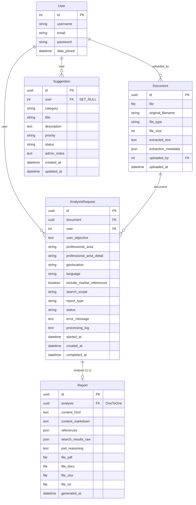
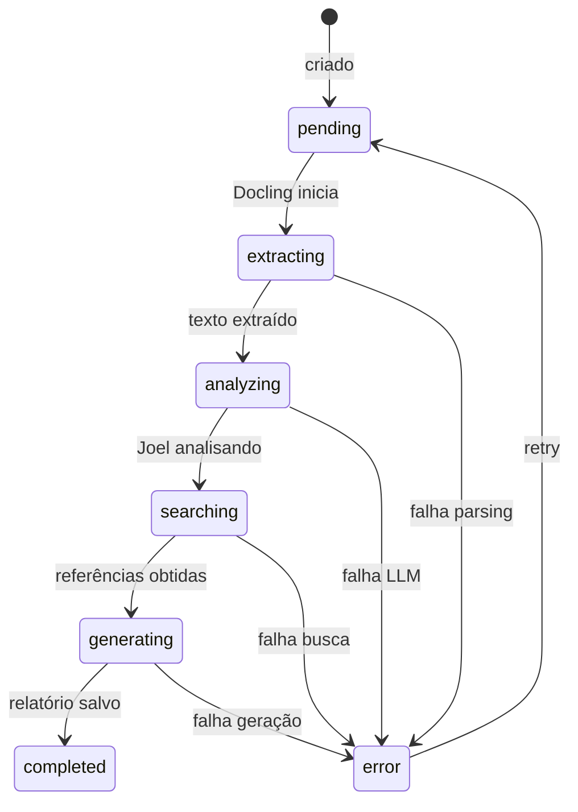

# Schema do Banco de Dados — Joel

## Diagrama ER (Mermaid)

## Status Flow (AnalysisRequest)

## Campos de Escolha

### professional_area
- `financeiro`, `juridico`, `saude`, `estetica`, `educacao`
- `tecnologia`, `treinamento`, `protocolo`, `marketing`
- `engenharia`, `outro`

### report_type
- `analitico` — Análise detalhada com métricas
- `comparativo` — Comparação com mercado/referências
- `resumo_executivo` — Síntese para decisores
- `tecnico` — Parecer técnico estruturado
- `parecer` — Opinião profissional fundamentada

### language
- `pt-BR` — Português (Brasil)
- `en` — English
- `es` — Español

### status (AnalysisRequest)
- `pending` → `extracting` → `analyzing` → `searching` → `generating` → `completed`
- Qualquer estado pode ir para `error`

### Suggestion.category
- `feature` — Nova Funcionalidade
- `ux` — Melhoria de UX
- `integration` — Integração
- `report` — Relatórios
- `bug` — Correção de Bug
- `other` — Outro

### Suggestion.priority (definida internamente)
- `low` — Baixa
- `medium` — Média
- `high` — Alta

### Suggestion.status (gerenciamento interno)
- `pending` — Pendente (nova)
- `reviewed` — Analisada pela equipe
- `planned` — Planejada para implementação
- `implemented` — Implementada
- `declined` — Recusada
